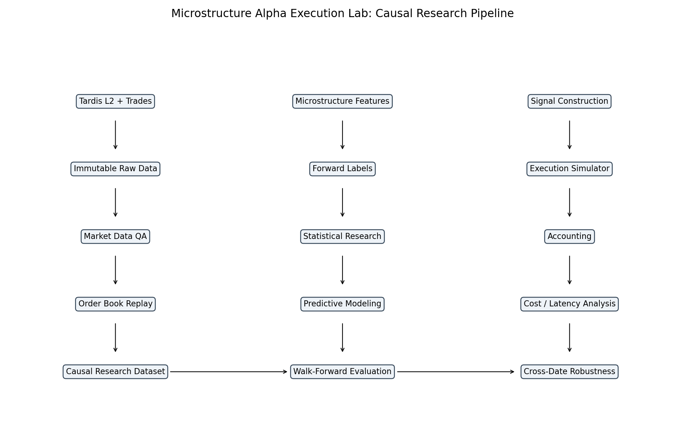

<div align="center">

# Microstructure Alpha & Execution Lab

**Causal L2 research → walk-forward alpha → event-driven execution → cost robustness**

[](https://github.com/H2nryHe/Microstructure_Alpha_Execution_Lab/actions/workflows/tests.yml)
[](https://github.com/H2nryHe/Microstructure_Alpha_Execution_Lab/actions/workflows/research-smoke.yml)


*Can BTC-USDT order-book and order-flow signals forecast short-horizon price moves — and does that signal survive the mechanics and costs required to trade it?*

</div>

---

## 60-second result

This repository is an end-to-end market-microstructure research system built around **incremental L2 order-book data and trades**. It reconstructs market state causally, engineers leakage-controlled features, validates short-horizon signals, retrains models chronologically, converts predictions into trading states, simulates execution and accounting, and then attacks the result with latency, fee, queue, inventory, and cross-date robustness tests.

> **Core conclusion:** short-horizon predictive structure is strong and reproducible, but better predictive IC does **not** automatically produce better net trading economics. Turnover, spread, latency, queue uncertainty, and residual inventory materially constrain monetization.

### Headline evidence

| Question | Result |
|---|---|
| **Is there a real short-horizon signal?** | Queue imbalance reached **~0.43 mean daily Spearman IC at 1s**, with **24/24 development dates positive** across ~20.7M observations. |
| **Does multivariate ML add information?** | Extended LightGBM added **+0.0107 mean IC** versus direct QI across **18 expanding walk-forward folds**, positive in **18/18** folds. |
| **Does higher predictive IC improve economics?** | Not robustly. The simpler QI signal remained the stronger market-efficiency baseline across the cross-date execution study. |
| **How much cost headroom remains?** | QI's six-date 0ms **mean / median breakeven fee was ~0.687 / 0.440 bps**; only **3/6** dates stayed net-positive at 0.25 bps and **2/6** at 0.50 bps. |
| **Can passive execution solve the spread problem?** | Not cleanly. Passive fills remained low, queue-sensitive, adverse-selection-prone, and inventory-constrained. |
| **Was the system performance-engineered?** | Profiling-driven refactoring cut the representative feature-engineering benchmark from **1.493s to 0.292s (5.11×)** with an **exact reference-vs-optimized output SHA-256 match**. |

---

## System architecture



```text
Tardis L2 + Trades
        ↓
Immutable Raw Data
        ↓
Market Data QA
        ↓
Causal Order-Book Replay
        ↓
Research Dataset
        ↓
Microstructure Features + Forward Labels
        ↓
Statistical Research + Walk-Forward Modeling
        ↓
Signal Construction
        ↓
Event-Driven Execution
        ↓
Portfolio Accounting
        ↓
Cost / Latency / Queue / Inventory Stress
        ↓
Cross-Date Robustness
```

Performance engineering wraps the pipeline without changing the research semantics.

---

## Why this is not a toy backtest

- **Observation-time causality.** Exchange timestamps are preserved, but local observation time plus source order governs replay so the research never silently reorders what a live process could have observed.
- **Frozen research design.** Development dates were selected before predictive analysis; 2026 remains an untouched temporal holdout.
- **Leakage controls.** Feature windows are strictly backward-looking, labels strictly forward-looking, cross-day leakage is disabled, and suspicious results are attacked with changed-state, non-overlap, permutation, and temporal-mismatch checks.
- **Execution before economics.** Signals are desired states, not fills. Market and passive orders pass through latency-aware event-driven execution, partial-fill logic, queue assumptions, cancellations, and inventory accounting.
- **Costs are applied explicitly.** Fee stress is separated from fill mechanics so spread/slippage is not double-counted.
- **Deterministic artifacts.** Major stages emit hashes, manifests, compact reports, regression tests, and CI-verifiable outputs.

---

## Research findings

### 1. Queue imbalance is the dominant simple signal

Top-of-book queue imbalance produced the strongest interpretable baseline. The development study found approximately **0.426 mean daily 1s Spearman IC**, with all 24 pre-registered development dates positive.

The strong result was treated as suspicious until it survived targeted audits:

- changed-state-only IC: ~0.447
- non-overlap IC: ~0.425
- five-minute temporal-mismatch control: ~0.004

Microprice and deeper imbalance features were useful but highly redundant with QI. **OFI provided the clearest incremental information beyond QI.**

### 2. ML adds signal, but only modestly

A direct QI baseline remained hard to beat. Under chronological retraining, Extended LightGBM improved mean IC by approximately **+0.0107** across 18 expanding folds, while QI+OFI added approximately **+0.0067**.

The important result is not that "LightGBM wins." It is that a simple, interpretable microstructure variable captured most of the ranking structure, while nonlinear modeling added a small but repeatable adjustment.

### 3. Predictive strength and economic efficiency diverge

The primary q10/q90 signal rule produced active coverage of roughly:

| Signal | Active coverage |
|---|---:|
| QI | 21.7% |
| QI + OFI | 20.2% |
| Extended | 17.3% |

Extended predictions produced stronger conditional future-mid separation, but the more complex signals also changed states differently and created additional turnover. Once execution and costs were introduced, stronger predictive IC did not robustly dominate the simpler QI baseline economically.

---

## Execution reality

The execution layer separates **prediction quality** from **realizability**.

### Market orders

- high fill certainty
- immediate spread / displayed-depth cost through the actual fill price
- latency changes the market state seen at arrival
- higher turnover quickly consumes sub-basis-point predictive edge

### Passive orders

- conservative queue-position approximation from visible L2 depth
- partial fills, TTL, cancel handling, and taker-on-arrival behavior
- low fill participation in the reference diagnostics
- residual inventory and post-fill adverse-selection risk remain visible

The project deliberately does **not** claim exact FIFO queue reconstruction from L2 data.

---

## Cost and cross-date robustness

The reference-day study showed very thin market-order transaction-cost headroom. The later mechanically selected six-date robustness study produced a more nuanced result:

- QI six-date **mean breakeven fee at 0ms:** ~0.687 bps
- QI six-date **median breakeven fee at 0ms:** ~0.440 bps
- QI net-positive days at **0.25 bps:** 3/6
- QI net-positive days at **0.50 bps:** 2/6
- Extended / QI+OFI did not robustly improve net economics versus QI

This is the central research lesson of the repository:

> **Predictive alpha ≠ executable gross edge ≠ cost-adjusted net edge.**

---

## Performance engineering

Profiling identified repeated trailing-window aggregation as a material feature-engineering bottleneck. A bounded refactor replaced repeated work with a more efficient accumulator while preserving the frozen scientific output.

| Benchmark | Reference | Optimized | Speedup |
|---|---:|---:|---:|
| Feature-engineering stage | 1.493s | 0.292s | **5.11×** |
| Representative orchestration | 2.991s | 0.606s | **4.94×** |

The reference and optimized feature outputs matched exactly by SHA-256. C++ acceleration was evaluated after profiling and **not introduced** because the measured bottleneck did not justify the additional complexity.

---

## Verified scale

| Item | Scale |
|---|---:|
| L2 rows on engineering validation day | **6.49M** |
| Completed event states | **816K** |
| Fixed 100ms observations | **864K / day** |
| Leakage-controlled features | **91** |
| Pre-registered development dates | **24** |
| Primary state-observation research rows | **~20.7M** |
| Expanding walk-forward folds | **18** |

---

## Quick start

**Python 3.11+** is expected.

```bash
python -m pip install -e ".[dev]"
python -m pytest
microalpha-smoke --manifest-out /tmp/microalpha-smoke.yaml
```

Run the bounded performance demo without downloading the full historical research dataset:

```bash
PYTHONPATH=src MPLCONFIGDIR=/tmp/microalpha-mpl \
python3 scripts/run_phase16_performance.py \
  --output-dir /tmp/microalpha-phase16-demo/reports \
  --work-root /tmp/microalpha-phase16-demo/work \
  --repetitions 1
```

The smoke path is intentionally lightweight. Full historical research reproduction requires external Binance/Tardis source files that are kept outside Git.

---

## Repository map

```text
src/microalpha/        research, replay, execution, accounting, utilities
configs/               frozen research / execution configuration
data/manifests/        deterministic plans and artifact identities
scripts/               reproducible stage runners and verification tools
tests/                 unit, integration, causality, determinism checks
reports/final/         final report, metrics registry, summary, figures
reports/phase16/       performance-engineering evidence
.github/workflows/     Python 3.11 tests and research-smoke CI
```

---

## Deep dives

| Document | Purpose |
|---|---|
| [Project summary](reports/final/PROJECT_SUMMARY.md) | 500–800 word technical overview |
| [Final research report](reports/final/MICROSTRUCTURE_ALPHA_EXECUTION_LAB_REPORT.md) | Full methodology, findings, failures, and limitations |
| [Final metrics registry](reports/final/FINAL_METRICS.json) | Source-traceable public numeric claims |
| [Final artifact index](reports/final/FINAL_ARTIFACT_INDEX.md) | Canonical public outputs and hashes |
| [Reproducibility guide](REPRODUCIBILITY.md) | Environment, data policy, determinism, and reproduction |
| [Data guide](DATA_GUIDE.md) | Instrument mapping, source conventions, and raw-data policy |
| [Performance engineering](reports/phase16/PERFORMANCE_ENGINEERING.md) | Profiling, hotspot selection, optimization, and equivalence evidence |
| [Release checklist](RELEASE_CHECKLIST.md) | Public/private, CI, packaging, and release hygiene |

---

## Limitations

This is a historical **BTC-USDT** research system built from Binance/Tardis reconstruction. It uses displayed-book data only, does not observe hidden liquidity, does not model endogenous self-impact or strategic market reaction, and uses a simplified passive queue approximation. Fee overlays are generic research stresses rather than live venue pricing.

Execution robustness covers a bounded development-date sample rather than the entire historical universe. The repository does **not** claim production trading performance or profitability.

**2026 remains an untouched temporal holdout reserved for a future confirmatory evaluation after the research and execution rules are fully frozen.**

---

<div align="center">

**Research complete · deterministic artifacts · Python 3.11 CI verified**

</div>
