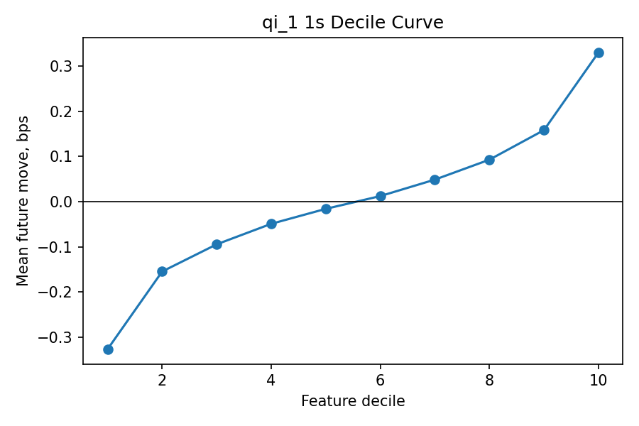
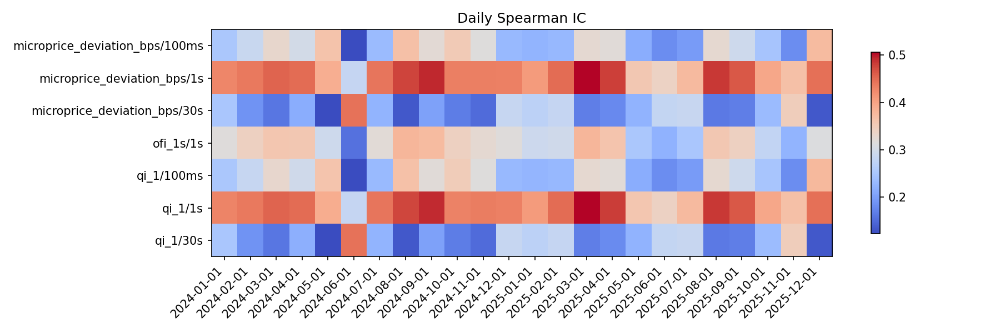
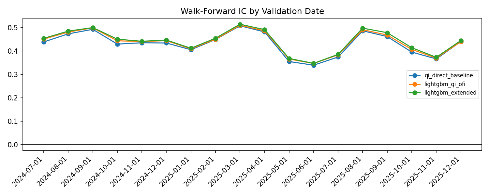
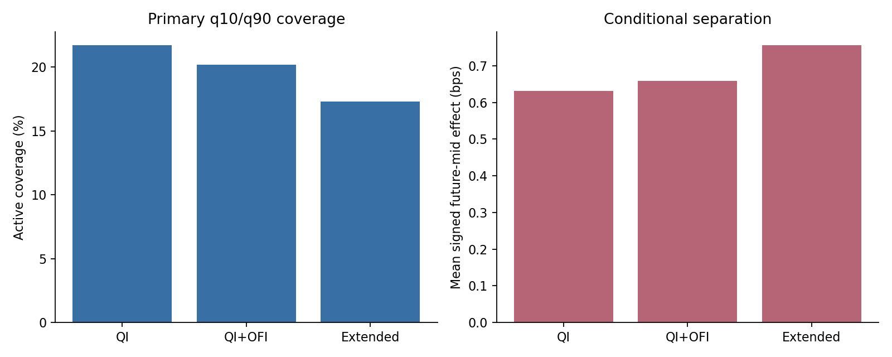
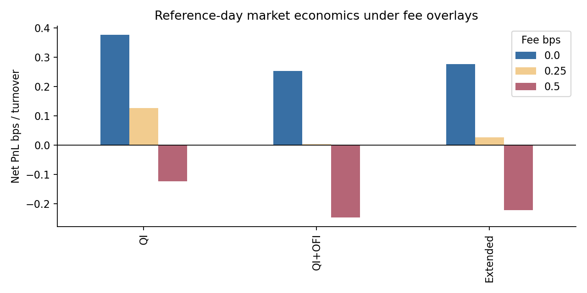
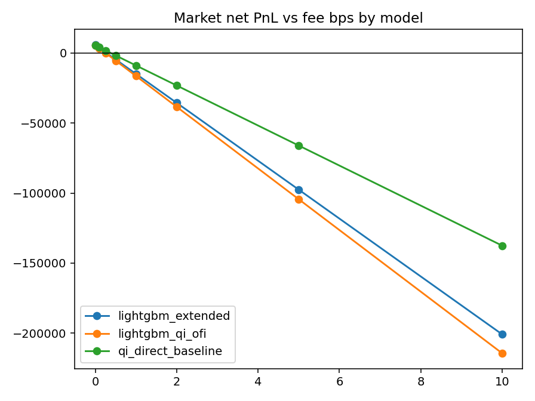
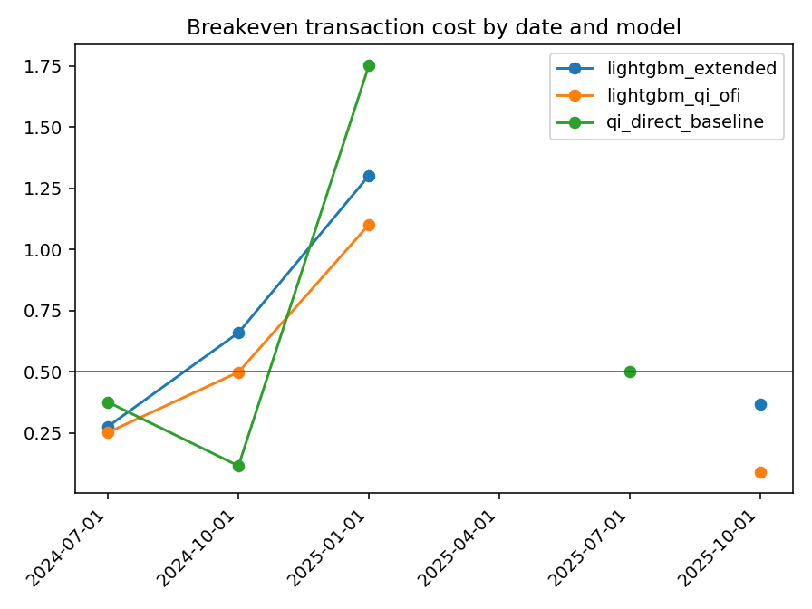
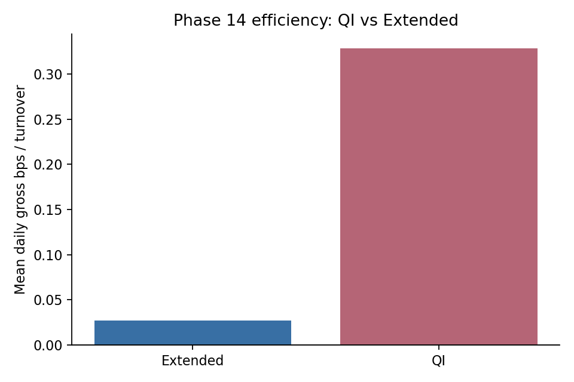
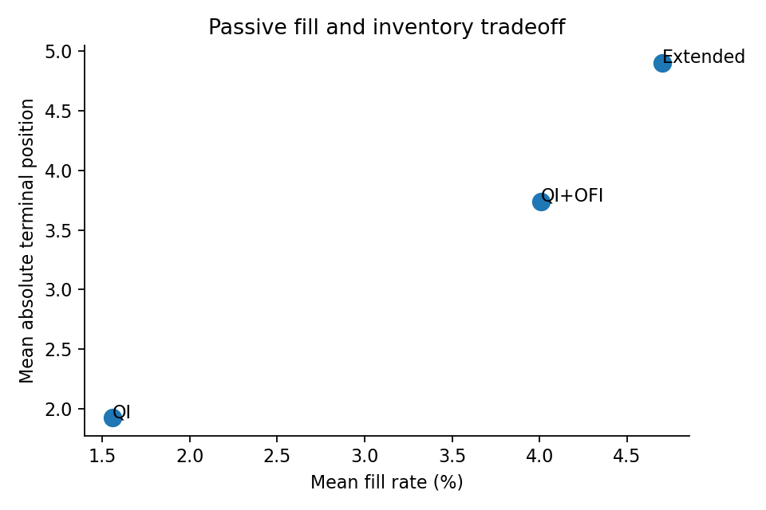

# Microstructure Alpha Execution Lab Report

## Executive Summary

This project asks whether short-horizon order-book and order-flow signals in
BTC-USDT can be transformed from statistical predictability into executable
trading economics after realistic market-data, execution, accounting, cost,
latency, and robustness constraints.

The central result is deliberately mixed. Strong short-horizon microstructure
predictability was identified, especially from top-of-book queue imbalance and
order-flow imbalance. QI produced a 0.426 mean daily Spearman IC against 1s
forward returns, with 24/24 development dates positive. Multivariate LightGBM
models added modest but consistent predictive lift: Phase 8 found +0.008
Extended LightGBM lift over the QI baseline, and Phase 9 found +0.0107 Extended
delta across 18 expanding folds.

That predictive lift did not automatically become robust net trading economics.
The reference-day market execution diagnostics showed 0.376 bps QI market 0ms,
0.252 bps QI+OFI market 0ms, and 0.277 bps Extended market 0ms gross PnL per
turnover. Phase 13 then showed thin cost headroom: 0.376 bps QI reference
breakeven, 0.253 bps QI+OFI reference breakeven, and 0.277 bps Extended
reference breakeven. On the six primary dates in Phase 14, QI still ranked first
in 8 first-place efficiency contexts, while Extended minus QI averaged a
-2443.68 mean Extended-minus-QI net delta at the 0.25 bps, 0ms market setting.

The project therefore demonstrates both sides of microstructure research. It
shows how a causal, reproducible pipeline can identify strong alpha-like
predictive structure. It also shows why statistical predictability is not
equivalent to executable economics once turnover, spread crossing, latency,
transaction costs, passive fill uncertainty, and residual inventory are made
visible. 2026 remains an untouched temporal holdout.

## Research Question

The research question was:

Can BTC-USDT limit-order-book and trade-flow signals forecast short-horizon
future mid-price movement, and do those forecasts retain economic value after
event-driven execution, accounting, latency, transaction-cost, and cross-date
robustness tests?

The project intentionally separates four ideas that are often conflated:

- statistical signal: whether a feature ranks future returns;
- predictive model: whether a model improves forecast quality over a simple
  baseline;
- desired trading state: whether forecasts can be converted into long, short,
  or flat intent without peeking;
- executable economics: whether fills, turnover, fees, latency, and inventory
  leave usable net edge.

The final answer is not a single backtest number. The strongest finding is that
queue imbalance and OFI contain real short-horizon predictive information, while
the economic conversion of that information is fragile.

## System Architecture

The canonical pipeline is:

```text
Tardis L2 + Trades
    -> Immutable Raw Data
    -> Market Data QA
    -> Order Book Replay
    -> Causal Research Dataset
    -> Microstructure Features
    -> Forward Labels
    -> Statistical Research
    -> Predictive Modeling
    -> Walk-Forward Evaluation
    -> Signal Construction
    -> Execution Simulator
    -> Accounting
    -> Cost / Latency Analysis
    -> Robustness
```


Each stage writes deterministic manifests or compact reports, and later stages
reference upstream artifact identities instead of silently regenerating inputs.
This matters because small changes in timestamp semantics, book replay ordering,
feature cutoff rules, or signal thresholds can change the interpretation of a
microstructure result.

## Data and Reproducibility

The project started with real market-data hardening before statistical research.
Raw vendor files are treated as immutable byte streams. The ingestion layer
preserves raw files unchanged, computes SHA-256 checksums, records source
metadata, and writes normalized bronze outputs separately. Vendor-specific
parsing is isolated behind adapters so downstream schemas remain
vendor-agnostic.

The initial real validation used Binance official public historical trades for
BTCUSDT and Tardis normalized Binance incremental L2 data for book replay.
Tardis was selected for the replay path because Binance's standard public
historical archive was not assumed to contain historical incremental Spot L2
updates. The canonical internal instrument is BTC-USDT and the vendor symbol is
BTCUSDT.

The important design point is that vendor data is not trusted merely because it
comes from a reputable source. The project records what the vendor supplied,
what the adapter believed each timestamp meant, what checksum identified the
source file, and what normalized schema was produced. This gives each later
research result a lineage back to a concrete file and parser decision. It also
makes failures easier to classify: a bad raw file, a bad adapter assumption, a
QA violation, and a modeling regression are different failures and should not be
debugged as if they were the same problem.

Verified scale includes 6.49M L2 rows on the 2019 validation day, 816K completed
event states, and 864K fixed 100ms observations. Feature engineering produced
91 leakage-controlled features. Later statistical research used 24 development
dates and roughly ~20.7M observations in the primary Phase 7 state-observation
scale. Phase 9 used 18 expanding folds for chronological walk-forward
evaluation.

Reproducibility is enforced by schema contracts, checksums, deterministic
config hashes, source availability checks, CI, and artifact manifests. One
engineering lesson was the Tardis HEAD-vs-GET source availability bug: a HEAD
probe could fail even when a GET request to the known-good data source worked.
The fix was not to weaken source verification, but to make the verification
match the real access path.

Another portability lesson was the YAML `null` parser issue. Under PyYAML, an
unquoted mapping key `null` becomes Python `None`, which broke canonical JSON
hashing in CI. The fix renamed the key to `null_baseline` and added recursive
validation requiring YAML mapping keys to load as strings.

## Causal Order-Book Reconstruction

The order-book reconstruction is one of the most important technical controls
in the project. Exchange event time was not assumed to be monotonic. Instead,
local/receive observation time plus source row order governed replay. Book
updates were replayed in observable order, and source row order broke ties when
multiple rows shared the same local timestamp.

For each research row, the book state is the latest state observable at the
cutoff. Feature windows use only events with observation time at or before T.
Labels are generated strictly after T, using future fixed-clock observations,
and labels do not cross day boundaries. This avoids cross-day leakage and avoids
using exchange timestamps as if they were the time at which a strategy could
have known an event.

The fixed-clock dataset is therefore a sampled view of a replayed event stream,
not a raw resampling of vendor rows. That distinction matters because a book
update and a trade can have different exchange-time and receive-time orderings.
The replay code first constructs the observable state sequence, then the
research dataset asks what state was known at each fixed cutoff. This is a more
conservative framing than sorting everything by exchange time and assuming a
perfect observer.

The replay path also validates state integrity: invalid prices and quantities,
sequence problems where applicable, crossed or locked books, stale BBO, update
gaps, duplicate ingestion, and extreme discontinuities are surfaced through QA
manifests. This makes the data pipeline more than a file converter; it is a
causal market-data system.

## Feature Engineering

The feature set was organized into interpretable microstructure families.
Top-of-book state features include QI, microprice deviation, and depth
imbalance. Flow features include event-level OFI. Trade features include
aggressor imbalance and signed trade flow. Activity features include trade
counts and book update counts. Volatility and short-horizon momentum features
describe recent realized movement.

The redundancy story is important. QI and microprice are almost the same
top-of-book family; the audit found a near-deterministic relationship between
QI and microprice deviation. DI5 and DI10 were also highly correlated with QI.
OFI provided the clearest incremental information beyond QI because it captures
recent event-level pressure rather than only the current displayed state.

The pipeline produced 91 features, but the final interpretation does not treat
all of them as independent discoveries. The strongest simple signal remained
top-of-book queue imbalance, with OFI adding the most defensible incremental
information.

## Leakage Controls

Leakage controls were built into the data model rather than added as a late
backtest filter. Feature rows carry observation and cutoff times. Feature
windows are backward-looking. Forward labels are generated after T. No feature
or label calculation reaches into the next day. The 2024 to 2025 development
sample is pre-registered, and 2026 is reserved.

Several robustness checks were added after the Phase 7 IC appeared unusually
strong. The changed-state audit found 0.447 changed-state IC for QI at 1s. The
non-overlap diagnostic found 0.425 non-overlap IC. A temporal mismatch control
using QI lagged by five minutes produced only 0.004 temporal mismatch IC. These
checks do not prove executable value, but they strongly reduce the probability
that the headline IC came from simple timestamp leakage or row duplication.

## Statistical Signal Research

The baseline statistical finding was that queue imbalance strongly ranks
short-horizon future returns. QI versus 1s forward return produced a 0.426 mean
daily Spearman IC, with 24/24 development dates positive. The result persisted
when the analysis excluded unchanged repeated states and when non-overlapping
sampling was used.

The decile and next-mid-move studies supported the same direction but require
careful wording. Extreme QI deciles had strong conditional next-mid-move
probabilities. That is not the same target as claiming a high accuracy for 1s
return prediction. The project therefore reports IC and conditional future-mid
diagnostics separately.





## Predictive Modeling

The modeling phase tested whether multivariate models added information beyond
simple QI. The QI baseline produced 0.422 QI baseline mean daily IC. The
Extended LightGBM model produced +0.008 Extended LightGBM lift, positive in
12/12 validation months. This is a modest effect, not a transformational one.

The model interpretation was consistent with the feature story. QI remained the
dominant ranking signal. LightGBM made systematic adjustments using OFI and
other microstructure information, but predictions remained highly correlated
with QI. This is useful because it means the multivariate model is improving the
simple signal at the margin rather than discovering an unrelated regime.

The modest size of the lift is itself informative. It suggests that the
top-of-book state already captures a large part of the predictable component at
this horizon. The model can improve ranking by reacting to recent flow and
activity context, but it cannot turn a short-horizon queue signal into a large
frictionless edge. That interpretation is also consistent with the execution
results: small predictive improvements can be overwhelmed if they require more
turnover or more fragile timing.

## Walk-Forward Stability

Walk-forward evaluation repeated the modeling question under chronological
retraining. Across 18 expanding folds, QI produced 0.432 QI mean IC. QI+OFI
added +0.0067 QI+OFI delta, positive in 17 of 18 folds. Extended added +0.0107
Extended delta, positive in 18 of 18 folds. The rolling-six-month variant
retained +0.0082 rolling-6 Extended delta, also positive in 18 of 18 folds.

This is the strongest predictive modeling conclusion: incremental predictive
lift survived repeated chronological retraining. It did not depend on a single
train/test split. It also did not justify changing the signal thresholds or
choosing a new strategy variant after seeing execution results.



## Signal Construction

Signals were constructed from frozen model predictions using the primary q10/q90
rule: the bottom training decile maps to short, the top training decile maps to
long, and the middle remains flat. This converts forecasts into desired states
without searching cutoffs after seeing outcomes.

The primary signal coverage differed by model. The QI signal had 21.7% QI
active coverage, QI+OFI had 20.2% QI+OFI active coverage, and Extended had
17.3% Extended active coverage. Extended produced stronger conditional
future-mid separation, but lower coverage and different churn. The Phase 10
transition diagnostics are therefore a trading-state diagnostic, not a PnL
claim.



## Execution Simulation

The execution simulator moved the project from desired state to orders and
fills. Market orders provided high fill certainty but paid spread, displayed
depth consumption, and latency costs through fill prices. Passive orders avoided
immediate crossing when filled, but introduced queue uncertainty, partial fills,
expired orders, adverse selection, and residual inventory.

The reference-day passive fill rates were low. The Phase 11 passive scenarios
ranged from the 1.5% to 4.5% passive fill-rate range across model and latency
settings. That is not a calibrated exchange queue-position claim; it is a
bounded conservative diagnostic that shows how sensitive passive execution is to
the fill model.

This separation between signal and execution is critical. A long signal does
not mean the portfolio becomes long at the signal timestamp. It means an order
is created under the simulator's rules, arrives after configured latency, and
then interacts with the reconstructed book and trade stream. Market orders,
passive orders, partial fills, and no-fill outcomes are therefore different
ways of realizing the same desired state. The project reports those mechanics
directly instead of treating the signal as if it were a filled position.

## Accounting and PnL

Accounting made fills, cash, turnover, realized PnL, unrealized terminal PnL,
and inventory explicit. Phase 12 is a development diagnostic, not final
confirmation. On the reference day, market 0ms gross PnL per turnover was 0.376
bps QI market 0ms, 0.252 bps QI+OFI market 0ms, and 0.277 bps Extended market
0ms.

Extended generated larger absolute gross dollars than QI on that day, but it
used much more turnover. QI had better efficiency per unit turnover. This is the
first clear place where predictive or gross-dollar improvement started to split
from economic efficiency.



## Transaction Costs and Latency

Phase 13 applied generic fee overlays and latency stress. The main result was
thin cost headroom. The reference-day market breakeven fees were 0.376 bps QI
reference breakeven, 0.253 bps QI+OFI reference breakeven, and 0.277 bps
Extended reference breakeven. At a 0.50 bps fee overlay, no reference-day market
scenario remained net positive.

This does not negate the predictive signal. It says the edge is small relative
to realistic frictions, especially when translated into market orders. The
project therefore distinguishes "predictive alpha existed" from "execution
economics survived."



## Cross-Date Robustness

Phase 14 attacked the one-day economic conclusions using six primary dates:
2024-07-01, 2024-10-01, 2025-01-01, 2025-04-01, 2025-07-01, and 2025-10-01.
The plan was frozen before running the new date outcomes.

Across the six-date market robustness sample, QI remained the strongest
market-efficiency baseline. QI had 0.687 bps QI mean breakeven at 0ms and 0.440
bps QI median breakeven at 0ms. Extended had 0.652 bps Extended mean breakeven at 0ms.
Cost survival was still limited: QI had 3/6 QI net-positive days at
0.25 bps and 2/6 QI net-positive days at 0.50 bps.

Model ranking was not stable enough to crown the more complex model. QI took 8
first-place efficiency contexts by gross bps per turnover. Extended was
competitive in some gross-dollar settings, but Extended minus QI had a
-2443.68 mean Extended-minus-QI net delta at 0.25 bps and 0ms. QI+OFI also did
not robustly beat QI economically under the same moderate-cost framing.

Passive execution remained fill-constrained and assumption-sensitive. QI had
1.56% QI passive mean fill rate at 0ms. Extended had 4.70% Extended passive mean
fill rate but also 4.79 mean Extended terminal position at 0ms. Higher fill
participation did not systematically produce better economics because inventory
and adverse-selection diagnostics remained visible.







## What Worked

The project produced a reproducible causal data pipeline from real incremental
L2 and trade data. Raw data was preserved, normalized, checked, and replayed
with explicit observation-time semantics.

The statistical signal research worked. Queue imbalance showed strong and
stable short-horizon rank information. OFI added incremental information beyond
QI. The multivariate LightGBM model produced small but consistent predictive
lift under chronological retraining.

The execution and accounting systems worked as falsification tools. They showed
where predictive gains became turnover, where turnover became cost exposure,
and where passive execution produced low fills and residual inventory. The
strongest complete finding is that predictive strength is not the same as net
execution economics.

## What Failed

More complex models did not reliably improve cost-adjusted economics. Extended
and QI+OFI improved predictive IC, but they often added turnover faster than
they added economic efficiency.

Passive execution did not automatically solve the spread problem. Conservative
queue assumptions led to low fill rates, partial fills, expired orders, and
residual inventory. Higher fill participation sometimes came with worse
markouts or inventory exposure.

Transaction-cost headroom remained small. The one-day reference breakevens were
below 0.4 bps, and multi-date robustness showed that 0.50 bps fee survival was
limited. One cannot infer executable value from IC alone.

The most important failed shortcut is the idea that a strong rank IC can be
treated as a trading result. It cannot. IC says the feature orders future
returns; it does not say the edge is large enough to pay spread, fees, latency,
or inventory risk. The second failed shortcut is the idea that a more complex
model should be preferred because it has higher predictive IC. In this project,
that higher IC was real, but the simple QI baseline often remained more
efficient after execution. The third failed shortcut is the idea that passive
orders are automatically superior because they avoid immediate crossing. Under
the conservative fill model used here, passive execution often meant not
getting filled, getting partially filled, or carrying residual inventory into
the terminal mark.

## Limitations

This project is limited to BTC-USDT and Tardis/Binance historical
reconstruction. It uses displayed book data only and does not observe hidden
liquidity. It does not model self-impact, market reaction to repeated trading,
or venue-specific order-routing behavior.

The passive queue model is approximate. It is useful for conservative
diagnostics, not as a calibrated exchange-position model. Fee grids are generic
research stresses, not live venue pricing. The primary signal rule is mechanical
and fixed, but it is still only one rule family. Execution robustness spans a
pre-specified subset of development dates and remains limited relative to the
full development universe.

Most importantly, 2026 remains unopened. The report synthesizes development
research through Phase 14; it does not claim final confirmatory out-of-sample
validation.

## Next Research Questions

The next confirmatory step is to freeze all research and execution rules, then
evaluate the untouched temporal holdout. Before that, the most useful research
extensions would be venue-fee-specific accounting, a better passive queue model,
explicit impact assumptions for repeated trading, and capacity diagnostics that
do not confuse displayed-depth consumption with actual market capacity.

Other useful questions are whether QI and OFI generalize to other liquid crypto
pairs, whether inventory-aware signal throttling can reduce residual exposure
without data-snooping, and whether passive fill quality can be improved without
choosing favorable queue assumptions after seeing results.

## Reproducibility

The project expects Python 3.11 or newer. CI includes the standard test workflow
and a `research-smoke` workflow. Local verification uses:

```bash
python -m pytest
ruff check src tests scripts
python -m compileall -q src scripts tests
microalpha-smoke --manifest-out /tmp/microalpha-smoke.yaml
```

Major frozen identities include accepted Phase 14 commit
7290d86afa18b67fdf0c46b2eeea22253dab7bc1, GitHub Actions tests run 31413110254,
and research-smoke run 31413111431. The frozen Phase 14 plan hash is
a0315262cb252c9e8b0bb0d63891e92cdfe5d16d0d7924cc570dc49b64107317, and the
Phase 14 results hash is
6da1560197c3619f72bbaaf4a76673dcd4c9313f1f8c33dfc3106b694659da0a.

The final numeric registry is [FINAL_METRICS.json](FINAL_METRICS.json). The
artifact index is [FINAL_ARTIFACT_INDEX.md](FINAL_ARTIFACT_INDEX.md). Large raw
and derived market-data artifacts remain outside Git; compact manifests,
reports, and figures are tracked. Determinism principles are: preserve raw
bytes, hash configurations and artifacts, avoid absolute paths in canonical
hashes, and keep research dates and rules frozen before outcome inspection.

2026 is reserved as an untouched temporal holdout for a future confirmatory
evaluation after all research and execution rules are fully frozen.
